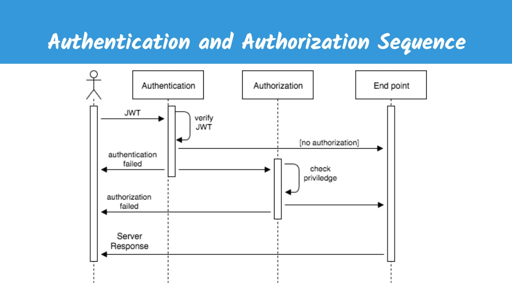

# Lecture JWT 2 & Error Handler

## 🦊Agenda

- Authentication
- Authorization
- Error Handler
- Environment variable

### Token JWT itu untuk apa sih?

- Untuk Authentication dan Authorization
- Token dari client akan di "konsumsi" dan di "translate" lagi menjadi payload, dan kemudian akan di cek data nya
- id pada payload akan menjadi kunci untuk validasi data tentang siapa yang sedang login

## Demo

| **User** |
| -------- |
| id       |
| email    |
| password |

| **Movies**  |
| ----------- |
| id          |
| name        |
| description |
| image_url   |
| author_id   |

#### TODO:

##### 1. Proteksi _ENDPOINT_ dengan menggunakan **Authentication**

- cek apakah request menyertakan Token
- _jika tidak_ => kasih error 401 dengan message "Invalid token"
- _jika iya_ => verifikasi/read Token
- cek apakah id didalam payload exist di database
- _jika tidak exist_ => kasih error 401 "Invalid token"
- _jika exist_ => simpan data2 user yang sudah login ke dalam request
- **next()** untuk mempersilahkan lanjut ke endpoint yang dituju

###### 2. Terapkan **Authorization** pada method DELETE

- cek data movie yang akan di delete di database
- _jika tidak exist_ => berikan error 404 Movie not found
- validasi kepemilikan data
- _jika milik si user yang logged in_ => **next()** menuju handler
- _jika bukan_ => kasih error 403 "Forbidden"

###### 3. Terapkan **Error Handler**

- reference: http://expressjs.com/en/guide/error-handling.html#writing-error-handlers
- Dengan error handler kita bisa menghindari yang namanya WET (Write EveryTime)
- middleware tapi diletakkan di paling belakang
- isi dengan conditional untuk menentukan res.status(400-500).json(output)

###### 4. Proteksi Credential dengan menggunakan **Environment Variable (.env)**

- untuk menginstall env local perlu bantuan dari package dotenv
- pasang dotenv di app.js dipaling atas entry point
